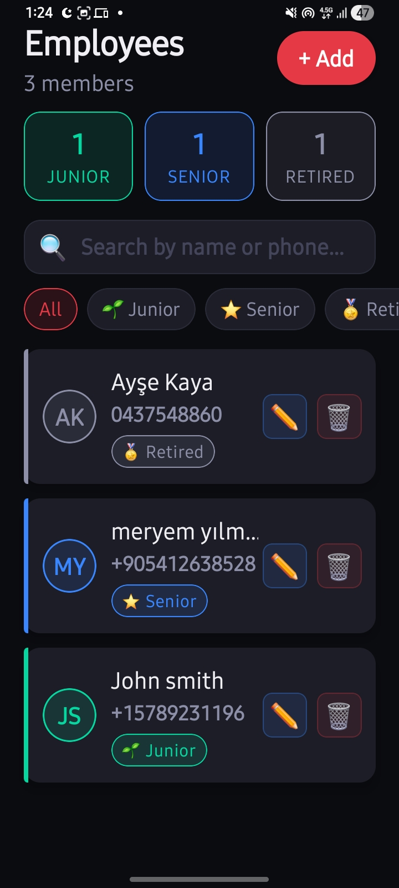
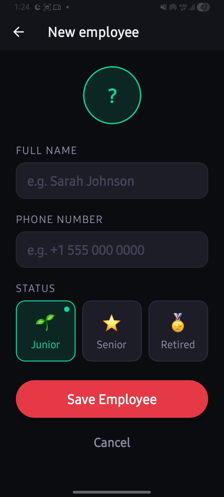
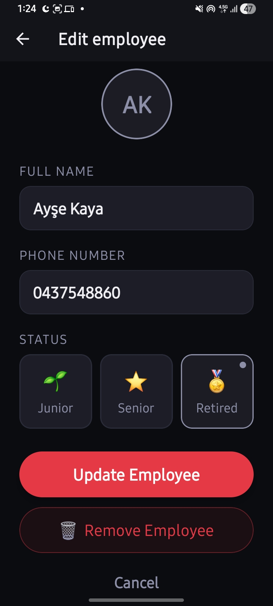

# EmployeeManager 

A modern, cross-platform employee management application built with **Expo**, **React Native**, and **Firebase**. Manage your team efficiently with an intuitive interface that works seamlessly on iOS, Android, and Web.

---

##  Overview

**EmployeeManager** is a comprehensive solution for managing employee records and information. Built using cutting-edge React Native technologies, this app provides a smooth user experience across multiple platforms. Whether you're running a small team or managing a larger workforce, EmployeeManager makes it easy to keep track of all your employees, their contact information, and professional status.

### Key Highlights

-  **Real-time Synchronization** - All changes sync instantly with Firebase backend
-  **Full CRUD Operations** - Create, read, update, and delete employee records
-  **Smart Search & Filter** - Find employees by name or phone number with live filtering
-  **Status Management** - Track employee levels (Junior, Senior, Retired)
-  **Universal Platform Support** - Run on iOS, Android, and Web without code changes
-  **Modern Dark UI** - Beautiful dark theme with intuitive design
-  **Fast Performance** - Optimized loading and responsive interactions
-  **Error Handling** - Comprehensive error management with user feedback

---

##  Screenshots

<div style="display: flex; flex-wrap: wrap; gap: 15px; justify-content: center;">
  <div style="text-align: center;">
    
   
   
   
  </div>
  
</div>
---

##  System Requirements

### Minimum Requirements
- **Node.js** version 16 or higher
- **npm** version 8 or higher
- **React Native** version 0.82.0 or compatible

### Platform-Specific Requirements

**iOS**
- macOS 12.0 or higher
- Xcode 14 or higher
- iOS 13.0 or higher (target)
- CocoaPods for dependency management

**Android**
- Android SDK 21 (Android 5.0) or higher
- Android Studio for emulation
- Java Development Kit (JDK) 11 or higher

**Web**
- Modern web browser (Chrome, Safari, Firefox, Edge)
- ES2020+ JavaScript support

### Firebase Setup
- Firebase project created at [firebase.google.com](https://firebase.google.com)
- Firestore database configured
- Authentication settings configured

---

##  Installation & Setup

### 1. Prerequisites Installation

```bash
# Install Node.js from https://nodejs.org (LTS version recommended)
# Verify installation
node --version
npm --version
```

### 2. Clone the Repository

```bash
# Clone or download the project
git clone <repository-url>
cd EmployeeManager
```

### 3. Install Dependencies

```bash
# Install all project dependencies
npm install

# Install required Expo modules
npx expo install firebase
npx expo install expo-router
npx expo install react-native-screens react-native-safe-area-context
npx expo install react-native-gesture-handler @react-native-async-storage/async-storage
```

### 4. Configure Firebase

1. Go to [Firebase Console](https://console.firebase.google.com)
2. Create a new project or select existing one
3. Navigate to **Project Settings → General**
4. Copy your Firebase configuration object
5. Update the configuration in both:
   - `firebaseConfig.js`
   - `lib/firebase.ts`

Replace the placeholder values with your Firebase project credentials:

```javascript
const firebaseConfig = {
  apiKey: "YOUR_API_KEY",
  authDomain: "YOUR_AUTH_DOMAIN",
  projectId: "YOUR_PROJECT_ID",
  storageBucket: "YOUR_STORAGE_BUCKET",
  messagingSenderId: "YOUR_MESSAGING_SENDER_ID",
  appId: "YOUR_APP_ID"
};
```

### 5. Create Firestore Collection

1. In Firebase Console, go to **Firestore Database**
2. Create a new collection named `employees`
3. Set appropriate security rules for your needs

### 6. Verify Installation

```bash
# Check that everything is installed correctly
npm list expo
npm list react-native
npm list firebase
```

---

## Usage Guide

### Starting the Development Server

```bash
# Start the Expo development server
npm start

# Or use the direct command
npx expo start
```

### Running on Different Platforms

#### iOS Simulator
```bash
npm run ios
# or
npx expo start --ios
```

#### Android Emulator
```bash
npm run android
# or
npx expo start --android
```

#### Web Browser
```bash
npm run web
# or
npx expo start --web
```

#### Expo Go (Physical Device)
1. Install Expo Go from App Store (iOS) or Play Store (Android)
2. Run `npm start`
3. Scan the QR code displayed in terminal

##  Project Structure

```
EmployeeManager/
├── app/                           # Expo Router pages and screens
│   ├── _layout.tsx               # Root layout wrapper
│   ├── index.tsx                 # Home/List screen
│   ├── add.tsx                   # Add employee form
│   ├── edit/
│   │   └── [id].tsx              # Edit employee form (dynamic route)
│   ├── modal.tsx                 # Modal screen template
│   └── (tabs)/                   # Tab group (if used)
│
├── components/                    # Reusable React components
│   ├── EmployeeCard.tsx          # Employee list item component
│   ├── StatusBadge.tsx           # Status indicator component
│   ├── themed-text.tsx           # Themed text component
│   ├── themed-view.tsx           # Themed view component
│   ├── parallax-scroll-view.tsx  # Parallax scroll component
│   ├── haptic-tab.tsx            # Haptic feedback tab
│   ├── hello-wave.tsx            # Welcome component
│   ├── external-link.tsx         # Link component
│   └── ui/                       # UI sub-components
│
├── constants/                     # Application constants
│   └── theme.ts                  # Colors, fonts, spacing, status metadata
│
├── hooks/                         # Custom React hooks
│   ├── use-color-scheme.ts       # Color scheme detection
│   ├── use-color-scheme.web.ts   # Web-specific color scheme
│   └── use-theme-color.ts        # Theme color hook
│
├── lib/                           # Business logic and utilities
│   └── firebase.ts               # Firebase operations (CRUD)
│
├── assets/                        # Static assets
│   └── images/                   # App icons and images
│       ├── icon.png
│       ├── splash.png
│       ├── favicon.png
│       └── android-icon-*
│
├── scripts/                       # Build and utility scripts
│   └── reset-project.js          # Project reset script
│
├── app.json                       # Expo app configuration
├── package.json                   # Dependencies and scripts
├── tsconfig.json                  # TypeScript configuration
├── eslint.config.js              # ESLint configuration
├── firebaseConfig.js             # Firebase configuration (legacy)
├── expo-env.d.ts                 # Expo environment type definitions
├── README.md                      # This file
└── LICENSE                        # Project license
```

### Key Files Explained

| File | Purpose |
|------|---------|
| `app/index.tsx` | Main home screen with employee list, search, and filters |
| `app/add.tsx` | Form to create new employees with validation |
| `app/edit/[id].tsx` | Dynamic route for editing individual employees |
| `components/EmployeeCard.tsx` | Displays individual employee information and action buttons |
| `components/StatusBadge.tsx` | Visual status indicator (Junior/Senior/Retired) |
| `constants/theme.ts` | Centralized theme colors, fonts, and status metadata |
| `lib/firebase.ts` | All Firebase operations: fetch, create, update, delete |
| `firebaseConfig.js` | Firebase project configuration credentials |
| `app.json` | Expo app metadata and platform configurations |

---

##  Firebase Configuration
### Firestore Database Structure

**Collection: `employees`**

Each employee document contains:

```javascript
{
  id: "auto-generated-id",        // Auto-generated by Firestore
  name: "John Doe",               // String: Employee full name
  phone: "+1 555 123 4567",       // String: Contact phone number
  statusLabel: "senior",          // String: "junior" | "senior" | "retired"
  createdAt: "2024-04-22T..."     // Timestamp: Server timestamp
}
```


```

### Contribution Guidelines

- Follow existing code style and conventions
- Add TypeScript types for new functions
- Test changes on multiple platforms (iOS, Android, Web)
- Update README if adding new features
- Ensure ESLint passes: `npm run lint`

---

##  License

This project is licensed under the MIT License - see the [LICENSE](LICENSE) file for details.

---


Last Updated: April 2026
Version: 1.0.0

- [Expo on GitHub](https://github.com/expo/expo): View our open source platform and contribute.
- [Discord community](https://chat.expo.dev): Chat with Expo users and ask questions.
